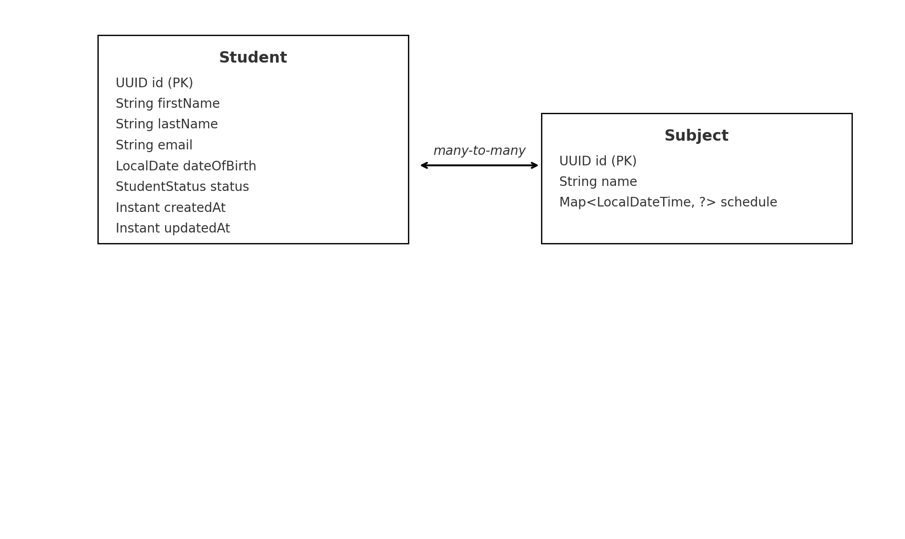

# Live-Coding

Build a Spring Boot application to manage students and classes with full CRUD operations, and implement functionality to assign students to classes.

## Technical Requirements
* Language: Java (21+ preferred)
* Framework: Spring Boot (3.x recommended)
* Database: H2
* Build Tool: Gradle

## Core Features
1. CRUD for Students
2. CRUD for Subject
3. Assign Students to Subjects - Look at chart.png for more details
4. Feel free to add anything else you consider important in this context.

Start with finding TO-DO's in the code, if you feel like something is off, feel free to question it, good luck!

